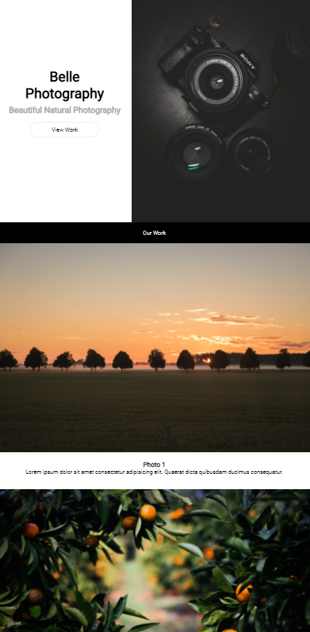
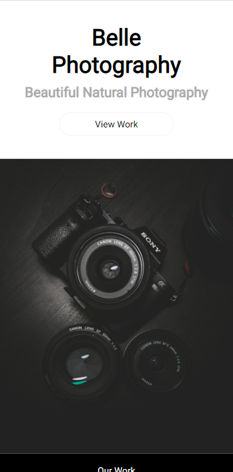

<body>
    <h1>
        Belle Photography Marketing Website
    </h1>
    

        حاول تنسيق صفحة الHTML لتطابق الرابط التالي
        <a href='https://israamoqbel.github.io/belle-photography/' target='_blank'>
        Belle Photography
        </a>
    

    

        <bold>ملاحظة: </bold>
        يجب أن يكون الموقع Responsive  أي يبدو بشكل جيد حتى على الموبايل والشاشات الصغيرة.
    

    

        على الشاشات الكبيرة
    

    
    

        على الشاشات الصغيرة
    

    
    

        برمجة ممتعة! :tada:
    

</body>